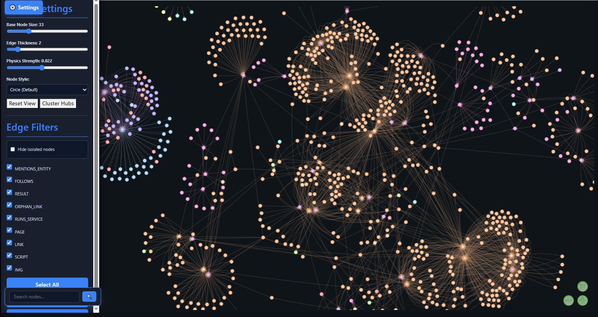

> [!IMPORTANT]  
>🚀 **Help Wanted!**
>
> I'm looking for contributors to help with **Vera**.  
> 
> **Please:**
> - Clone the repo  
> - Make improvements or fixes  
> - Push them back by opening a Pull Request (PR)  
>
> **Any help is appreciated — thank you!**
>
> **Vera is still very-much in development** any issues running or using the code please post an issue, I will get back to you asap. Please don't be surprised if something doesn't work or is unfinished.
>


<p align="center">
<a href="#-features"></a>
<a href="#-installation"></a>
<a href="#-usage"></a>
<a href="#-contributing"></a>
<a href="#License"></a>
<a></a>

</p>

<span align="center">

# **Vera:** Une âme sans corps

## A Self-Modifying Multi-Agent Cognitition Architecture with Proactive Background Reflection (SMMAC-PBR)


<!-- ## What is Vera? 
**A video and audio introduciton** -->
<!-- 
[](https://youtu.be/a3smyPocYZ8)   -->

<p align="center">
  <a href="https://youtu.be/a3smyPocYZ8" target="_blank"></a>

</p>
<span align="center">

📺 Follow the above link for an 8 minute video overview of Vera.  

🎧 [Listen to the Podcast](https://drive.google.com/file/d/1NaJC4ayEM2Vmf_ncW_MSEHf498yvRNhL/view?usp=sharing) - A 50 minute deep-dive podcast discussing the architecture of Vera.  

</span>

</span>
<!-- 📖 -->

## What is Vera?

Vera is an advanced multi-agent AI architecture inspired by principles from cognitive science and agent-based systems. It integrates a framework combining short-term and long-term memory, token prediction, task triage, reasoning, proactive focus management, self-modification, and modular tool execution to deliver flexible, intelligent automation.

### Use Case

Vera is designed to help with day-to-day tasks and planning without requiring you to repeat context repeatedly. It excels at:

- **Schedule Coordination:** Managing calendars, meetings, and project timelines
- **Project Advisory:** Understanding project context across sessions and providing informed guidance
- **Contextual Continuity:** Maintaining deep understanding of your work across multiple interactions
- **Proactive Planning:** Generating actionable next steps and identifying dependencies
- **Task Automation:** Handling routine workflows and multi-step processes autonomously

The key value proposition is **context persistence**. Rather than starting fresh with each interaction, Vera builds and maintains a comprehensive understanding of your goals, projects, and past work. This enables more nuanced advice and more efficient automation over time.

### Why Vera?

While many AI tools exist online, Vera was created to address a specific gap: a self-hosted, locally-running AI system that doesn't require cloud infrastructure or external API dependencies. The motivation has multiple dimensions:

**Self-Sovereignty:** Run everything locally on hardware you control. No data leaves your machine unless you explicitly configure external integrations. This provides privacy and independence from third-party service availability.

**Local Compute Exploration:** Vera is an exploration of how far modern LLMs can be pushed when given proper context, memory systems, and tool integration—all running on local hardware. The architecture demonstrates that sophisticated autonomous behavior doesn't require massive cloud resources; it requires smart architecture.

**Cost Efficiency:** After initial hardware investment, there are no ongoing API costs or subscription fees. For users running intensive workloads, this can represent significant savings compared to cloud-based solutions.

**Customization & Control:** Full source code control allows deep customization for your specific needs. Add custom tools, agents, and memory structures without vendor restrictions. Self-modification capabilities enable the system to evolve autonomously within your environment.

**Research & Experimentation:** Vera serves as a testbed for exploring multi-agent architectures, memory systems, and reasoning patterns. The modular design makes it suitable for academic research and experimental AI development.

**The Art of the Possible:** Ultimately, Vera exists to answer the question: given unrestricted context, persistent memory, proper tool integration, and architectural sophistication—how far can we push local AI systems? The answer is further than many assume.

## How does vera work?

Vera orchestrates multiple large language models (LLMs), specialized AI sub-agents and tools synchronously to tackle complex, high-level user requests. It decomposes broad tasks into discrete, manageable steps, then dynamically plans and executes these steps through various external and internal tools to achieve comprehensive outcomes.

This distributed agent design enables parallel specialization—some agents focus on rapid query response, others on strategic forward planning—while sharing a unified memory and goal system to maintain coherence across operations.

A hallmark of Vera's architecture is its capacity for proactive background processing. Autonomous sub-agents continuously monitor context and system state, coordinating via dynamic focus prioritization. This allows Vera to process perceptual inputs, data processing, and environmental interactions adaptively, even without direct user prompts, enabling it to enrich its own memories and progress toward long-term goals. 

Vera grounds its intelligence in a highly structured, multi-layered memory system (Layers 1-4) that mirrors human cognition by separating volatile context from persistent knowledge. This memory uses a hybrid storage model: the Neo4j Knowledge Graph stores entities and rich, typed relationships, while ChromaDB serves as a vector database for the full text content of documents, notes, and code, binding the textual information to its contextual network. All the while postgres is keeping an immutable, versioned record of everything.

Complementing these capabilities is Vera's integrated program synthesis and self-modification engine. This subsystem empowers Vera to review, generate, and iteratively improve its own codebase, extending its functionality autonomously without requiring manual reprogramming. By enabling self-reflection and continuous evolution, Vera maintains adaptability and resilience across rapidly changing task demands and environments.

---

>[!WARNING]
>**Vera has high system requirements**  
> Atleast 16Gb of system RAM, and 12 real cores (24 hyperthreaded) running at 3Ghz+ is the minimum recommended.  
>Please check the requirements section for more info

>[!NOTE]  
>**Vera utilises the Agentic-Stack-POC**  
> To bootstrap the various services required for vera we have built an AI develpoment framework called `Agentic Stack POC` its not required but reccomended.

## Contents:

### Getting Started
- [What is Vera?](#what-is-vera)
- [Key Features](#key-features)
- [System Requirements](#system-requirements)
- [Installation](#installation)
- [Quick Start](#quick-start)

### Usage & Configuration
- [Usage: Commands & Flags](#usage--commands--flags)
- [Configuration](#configuration)
- [Advanced Usage](#advanced-usage)

### Architecture & Deep Dives
- [Architecture Overview](#architecture-overview)
- [Core Capabilities](#core-capabilities)
- [Core Concepts](#core-concepts)
<!-- - [Component Status Guide](#component-status-guide) -->
- [Core Components](#core-components)
- [Component Deep Dive](#Component-Deep-Dive)
  - [Central Executive Orchestrator (CEO)](#1-central-executive-orchestrator)
  - [Proactive Background Cognition (PBT)](#2-proactive-background-cognition)
  - [Composite Knowledge Graph (CKG)](#3-composite-knowledge-graph)
  - [ToolChain Engine (TCE)](#4-toolchain-engine)
  - [API Integration Shim](#5-api-integration-shim)
  - [Babelfish Translator (BFT)](#6-babelfish)
  - [Integration API Shim (IAS)](#6-integration-api-shim)
  - [Self-Modification Engine (SME)](#7-self-modification-engine)
  - [User Interfaces](#user-interfaces)
- [Agents](#agents)
- [Ingestors](#ingestors)

### Extension & Contribution
- [Advanced Usage and Features](#advanced-usage-and-features)
- [Extending Vera](#extending-vera)
- [Contributing](#contributing)
- [Performance Optimization](#performance-optimization)

### Reference
- [Safeguarding & Data Privacy](#safeguarding--data-privacy)
- [FAQ & Troubleshooting](#faq--troubleshooting)
- [Known Issues](#known-issues)
- [License](#license)
- [Contact](Contact--Support)
- [Roadmap](roadmap)


---

## System Requirements

### Minimum Recommended Hardware

**CPU Build (Linux)**
- CPU: 12+ cores (24 hyperthreaded) @ 3GHz+
- RAM: 16GB–32GB (or up to 150GB for large deployments)
- HDD: 100GB
- GPU: None

**GPU Build (Linux)**
- CPU: Varies by workload
- RAM: 8GB system + 14–150GB VRAM
- HDD: 100GB
- GPU: 14–150GB VRAM (NVIDIA recommended)

### Understanding the Requirements

- **RAM:** Determines how many models can run simultaneously. 16GB minimum runs single models; 32GB+ enables parallel agent execution.
- **CPU cores:** Each agent requires ~1–2 cores. More cores allow higher parallelism. Hyperthreading counts as 0.5 cores each for planning purposes.
- **VRAM:** GPU builds allow running larger models (20B–70B parameters). CPU-only builds use quantized models (3B–13B).
- **Storage:** Accommodates Neo4j database, ChromaDB vector store, and model weights.

### Model Tier Recommendations

| Tier | CPU | RAM | Storage | VRAM | Use Case |
|------|-----|-----|---------|------|----------|
| **Basic** | 8 cores | 16GB | 100GB | — | Development & testing |
| **Standard** | 12+ cores | 32GB | 100GB | — | Production (CPU-only) |
| **Advanced** | 16+ cores | 64GB | 200GB | 14GB+ | GPU-accelerated |
| **Enterprise** | 24+ cores | 150GB+ | 500GB+ | 80GB+ | Large-scale deployment |

<!-- ### Supported LLM Models

| Model Type | Examples | Memory | Use Case |
|-----------|----------|--------|----------|
| **Fast LLM** | Mistral 7B, Gemma2 2B | 4–8GB | Triage, quick tasks |
| **Intermediate** | Gemma2 9B, Llama 8B | 8–16GB | Tool execution |
| **Deep LLM** | Gemma3 27B, GPT-OSS 20B | 16–32GB | Complex reasoning |
| **Specialized** | CodeLlama, Math models | Varies | Domain-specific | -->

### Minimum Viable Setup

If you have fewer resources, Vera runs with reduced capability:
- **16GB RAM + CPU only:** Single fast model, no parallelism
- **8+ physical cores:** Suitable for background processing, not real-time queries
- **Smaller SSD:** Start with one small model (3–7B parameters)

> [!NOTE]
> Vera is compatible with Windows; however, detailed configuration instructions are provided only for Linux, WSL, and macOS. Windows users may need to adapt the setup process accordingly.

---

## Installation

### System Dependencies

Vera requires several external services. You have two options:

**Option A: Automated Setup (Recommended)**

Use the companion [Agentic Stack POC](https://github.com/BoeJaker/AgenticStack-POC) to bootstrap all services via Docker:

```bash
git clone https://github.com/BoeJaker/AgenticStack-POC
cd AgenticStack-POC
docker compose up
```

This starts:
- Neo4j server (port 7687)
- Ollama with pre-configured models (port 11434)
- ChromaDB (port 8000)
- Supporting UIs

**Option B: Manual Setup**

Install required services individually:

```bash
# Install Ollama
curl https://ollama.ai/install.sh | sh

# Start Ollama and pull models
ollama serve &
ollama pull gemma2
ollama pull mistral:7b
ollama pull gpt-oss:20b

# Install Neo4j (see: https://neo4j.com/download)
# Installation varies by OS

# ChromaDB installs via pip (see below)
```

## Installation

### Quick Installation (Recommended)

```bash
# Clone the repository
git clone https://github.com/BoeJaker/Vera-AI
cd Vera-AI

# Use Makefile for automated installation
make install-system    # Install system dependencies
make install-python    # Create virtual environment
make install-deps      # Install Python dependencies
make install-browsers  # Install browser drivers
make setup-env         # Create environment configuration
make verify-install    # Verify installation
```

### Or use the single-command installation:
```bash
make full-install      # Complete installation process
```

### Manual Installation (Alternative)

1. **Clone the repository**
```bash
git clone https://github.com/BoeJaker/Vera-AI
cd Vera-AI
```

2. **Create virtual environment**
```bash
python3 -m venv venv
source venv/bin/activate  # On Windows: venv\Scripts\activate
```

3. **Install dependencies**
```bash
pip install -r requirements.txt
```

Key dependencies:
- `streamlit` - Python web UI framework
- `chromadb` – Vector database for semantic memory
- `playwright` – Browser automation and web scraping
- `requests` – HTTP client
- `tqdm`, `rich` – Terminal UI enhancements
- `python-dotenv` – Environment configuration
- `llama-index` – LLM framework

4. **Install browser drivers**
```bash
playwright install
```

5. **Configure environment variables**
```bash
cp .env.example .env
# Edit .env with your settings:
# - Neo4j connection URL and credentials
# - Ollama API endpoint
# - API keys for external services (optional)
```

### Makefile Installation Commands

**Complete Installation:**
```bash
make full-install                    # One-command full installation
```

**Step-by-Step Installation:**
```bash
make install-system                  # Install system dependencies
make install-python                  # Setup Python virtual environment  
make install-deps                    # Install Python packages
make install-browsers               # Install Playwright browsers
make setup-env                      # Create environment file
make verify-install                 # Validate installation
```

**Development Installation:**
```bash
make dev-install                    # Includes development dependencies
```

**Verification & Troubleshooting:**
```bash
make verify-install                 # Check all components
make check-services                # Verify required services
make install-fix-permissions       # Fix file permissions if needed
```

### Environment Configuration

After installation, configure your environment:

```bash
# Copy and edit environment template
make setup-env

# Edit the generated .env file
nano .env
```

Required environment variables:
```bash
# Neo4j Database
NEO4J_URL=bolt://localhost:7687
NEO4J_USER=neo4j
NEO4J_PASSWORD=your_password

# Ollama LLM Service
OLLAMA_BASE_URL=http://localhost:11434

# ChromaDB Vector Database
CHROMADB_HOST=localhost
CHROMADB_PORT=8000
```

### Verification

**Verify installation:**
```bash
make verify-install
```

**Check individual services:**
```bash
make check-services
```

**Test imports:**
```bash
python3 -c "from vera import Vera; print('✓ Vera imported successfully')"
```

If you see the checkmark, installation succeeded. If you get an error, check that all system services are running:

```bash
# Check Neo4j
curl http://localhost:7474

# Check Ollama  
curl http://localhost:11434/api/tags

# Check ChromaDB
curl http://localhost:8000/api/v1/heartbeat
```

### Troubleshooting

**Common issues:**
```bash
# Permission errors
make install-fix-permissions

# Missing dependencies
make install-system

# Browser installation issues
make install-browsers-force

# Environment setup
make setup-env-reset
```

**Service health checks:**
```bash
make check-health                  # Comprehensive health check
make check-neo4j                  # Check Neo4j connection
make check-ollama                 # Check Ollama service
make check-chromadb              # Check ChromaDB status
```

---

## Quick Start

### Terminal Interface

```bash
cd <your/path/to/vera>
python3 ./vera.py
```

### Web Interface

```bash
cd <your/path/to/vera>
streamlit ./ui.py
# Opens on localhost:8000
```

### Python API

```python
from vera import Vera

# Initialize Vera agent system
vera = Vera(chroma_path="./vera_agent_memory")

# Query Vera with a simple prompt
for chunk in vera.stream_llm(vera.fast_llm, "What is the capital of France?"):
    print(chunk, end="")

# Use toolchain execution for complex queries
complex_query = "Schedule a meeting tomorrow and send me the list of projects."
result = vera.execute_tool_chain(complex_query)
print(result)
```

### Docker Stack

```bash
docker compose up
```

---

## Usage: Commands & Flags

### System Flags

Use these flags at the command line when starting Vera:

| Flag | Description |
|------|-------------|
| `--triage-memory` | Enable triage agent memory of past interactions |
| `--forgetful` | No memories will be saved or recalled this session |
| `--dumbledore` | Won't respond to questions (Easter egg) |
| `--replay` | Replays the last plan |

### In-Chat Commands

Use these commands with `/` prefix in chat:

| Command | Purpose |
|---------|---------|
| `/help` | Display available commands |
| `/status` | Show system status and resource usage |
| `/memory-stats` | Display memory layer statistics |
| `/agents-list` | List active agents and their status |
| `/tools-list` | Show available tools |
| `/config` | Display current configuration |

---

## Configuration

Vera's configuration is controlled via environment variables in `.env`:

**LLM Configuration**
```
FAST_LLM_MODEL=mistral:7b
INTERMEDIATE_LLM_MODEL=gemma2
DEEP_LLM_MODEL=gpt-oss:20b
OLLAMA_API_BASE=http://localhost:11434
```

**Memory Configuration**
```
NEO4J_URL=bolt://localhost:7687
NEO4J_USER=neo4j
NEO4J_PASSWORD=your_password
CHROMA_PATH=./vera_agent_memory
```

**Performance Configuration**
```
MAX_PARALLEL_TASKS=4
CPU_PINNING=false
NUMA_ENABLED=false
```
---
## Core Capabilities

Vera can perform the following tasks through coordinated agent action:

**Autonomous Work**
- Report generation and data synthesis
- Research and trend discovery
- Media creation and podcast generation
- Programming and debugging
- Documentation generation
- Codebase monitoring
- Network security monitoring and vulnerability discovery

**System Management**
- Infrastructure monitoring and maintenance
- Disaster recovery
- System maintenance and troubleshooting
- Platform administration

**Integration & Planning**
- Project delivery and orchestration
- Customer service automation
- Personal assistant functions
- Guided human-oriented planning

---

## Core Concepts

### 1. Agents vs LLMs vs Encoders in Vera 
**A Multi-Level Hierarchy**

Vera’s architecture distinguishes between **LLMs** and **Agents**, each operating at multiple levels of complexity and capability to handle diverse tasks efficiently.

#### Encoders

- Encoders: Extremely light models specialized to encode text. Parses all data sent the vectorstore. 

#### Large Language Models (LLMs)

LLMs are the foundational language engines performing natural language understanding and generation. Vera uses several LLMs, each specialized by size, speed, and reasoning ability:

- **Fast LLMs:** Smaller, generalized text models, optimized for quick straightforward responses.
    
- **Intermediate LLMs:** Larger generalized text models that balance speed and reasoning capacity.
    
- **Deep LLMs:** Large, resource-intensive text models suited for complex reasoning and extended dialogues.
    
- **Specialized Reasoning LLMs:** Models fine-tuned or architected specifically for heavy logical textual processing and multi-step deduction.
    

Each LLM level provides different trade-offs between speed, resource use, and depth of reasoning. Models can be upgraded in-place meaning when a new model is released it is plug-and-play so to speak. The memories will carry over as if nothing changed.

##### How Levels Interact

- Lower-level LLMs handle quick, direct responses and routine tasks.
    
- Higher-level LLMs monitor overall goals, manage focus, and coordinate lower-level LLMs activities.
    
- LLMs at different levels are selected dynamically depending on task complexity and required depth of reasoning.
    

This multi-level, hierarchical approach allows Vera to balance responsiveness with deep cognitive abilities, making it a flexible and powerful autonomous AI system.

#### Agents

Agents are **LLM instances configured with augmented capabilities**, including memory management, tool integration, task triage, and autonomous goal setting. Vera’s agents also exist at multiple levels:

- **Triage Agents:** Lightweight agents responsible for prioritizing tasks and delegating work among other agents or tools.

- **Tool Agents:** Lightweight agents using fast LLMs to handle immediate simple tool invocations.
    
- **Strategic Agents:** Deep-level agents running large LLMs tasked with long-term planning, proactive reflection, and orchestrating complex tool chains.
    
- **Specialized Agents:** Agents with domain-specific expertise or enhanced reasoning modules, capable of focused tasks like code generation, calendar management, or data analysis.
    
These LLMs & Agents can communicate via shared memory and coordinate through a dynamic 


#### Micro Models
<a></a>

- **Micro Models:** Tiny models, specialized to complete one task or read a particular dataset. Can be built and trained on a case-by-case basis. Capable of massive parallel reasoning. 

#### Model Overlays
<a></a>

Allows you to overlay additional training onto existing models

<!-- 
### 2. Memories

#### Node
A single entity on the knowledge graph

#### Edge
A relationship between two nodes

#### Knowledge Base
A dynamic external data source like live web documentation or an api

#### Ingestor
Parses external datasets into the memory system i.e. network scans, 

#### Enricher
Enriches the knowledge graph 

#### Micro Buffer
Memory buffer for immediate context

### Meso buffer

#### Macro Buffer
Memory buffer for cross sessional context

#### Meta Buffer
Memory buffer for memory system context


#### Project
Defined in a json file, this is a collection of other memories and pointers relating to a real-world goal

#### Session
A string of interactions (inputs & outputs) connected in sequence. Found in the knowledge graph and vector store

#### Session (Node)
The first node of all sessions, contains information about the dependency versions, codebase versions, available tools, session level errors, resource availability.

#### Memory

#### Entity

#### Insight

#### Collection
A collection of texts relating to a session, entity or insight. Found in the vector store

### 3. Tools

#### Internal
These tools can interact with internal apis and services like the memory system

#### Management
Capable of managing the host system


####


### 4. Orchestration

#### Worker
A local task processor, used for quick low effort tasks

#### ClusterWorker
A remote task processor, computationally seperate from the host, used for sustained or high-effort tasks

#### Pool
The combined pool of workers both local and remote

#### ClusterPool
The remote pool of workers

#### Task
A processing task to be completed by the pool -->

---

## Core Components

#### Top level components:

All top level components are designed to run stand-alone or togehter as a complete framework.

**CEO - Central Executive Orchestrator**  
#in-development #poc-working  
Responsible for routing requests to the correct agent and creating, destroying & allocating system resources via workers.

**PBC- Proactive Background Cognition**  
#in-development #poc-working  
Responsible for co-ordinating long term goals, short term focus and delivering actionables during downtime

**TCE - Toolchain Executor**  
#in-development #poc-working  
Breaks down complex tasks into achievable steps then executes the plan using tools, built in or called via an MCP server.

**CKG - Composite Knowledge Graph**  
#in-development #poc-working  
Stores memories and their relationships in vector and graph stores. 
Systematically enriches information stored within the graph

**BFT - Babelfish Translator**  
#production #poc-working  
A protocol agnostic communication tool with encryption. Facilitates arbitrary webserver creation, ad-hoc network protocol comms. And VPN construction.

**IAS  - Integration API Shim**  
#production #poc-working  
Allows Vera to mimic other LLM APIs. Also allows those same APIs to interface with Veras systems.

**SME - Self Modification Engine**  
#in-development  
A full CI/CD pipeline for Ver to review and edit its own code.

**PF - Perceptron Forge**  
#in-development  
Allows Vera to build new models from the fundamental building blocks of all AI models - perceptrons.

**EP - Edit Pipeline**
#in-development  
Version control for edits the AI makes to files, settings etc


#### User Interfaces

**CUI - Chat UI**  
A web UI with full duplex speech synthesis

**OUI - Orchestrator UI**  
A web UI for management of the orchestrator

**TCEUI - ToolChain Executor UI**  
A standalone UI for managing the ToolChain Executor

**MX - Memory Explorer**  
A web UI enabling broad or targeted traversal of the knowledge graph


---

## Component Deep Dive

### 1. Central Executive Orchestrator
**Task scheduler & worker orchestrator**  

<a></a>


**Purpose:** Heart of Vera. Collects performance data, queues user input, and allocates or creates resources locally or in remote worker pools.

**Capabilities:**
- Identifies tasks and steps that can execute in parallel
- Schedules execution when resources available
- Manages local and remote worker pools
- Queues requests when resources exhausted
- Provides real-time performance metrics and resource utilization

**Example workflow:**

```
1. Query received: "Scan network and analyze results"
2. Query triaged to Toolchain Executor
3. TCE requests: network scanner + analysis LLM
4. CEO: network scanner available → allocate
5. CEO: all analysis LLMs busy → queue request
6. Network scan runs
7. Analysis LLM becomes free
8. CEO dequeues and provides resources
9. TCE receives scan results for analysis
```

**Configuration:**
```python
ceo = CEOOrchestrator(
    max_parallel_tasks=4,
    max_queue_depth=20,
    resource_polling_interval=0.5  # seconds
)
```
---

### 2. Proactive Background Cognition

<a></a>

[Proactive Background Cognition Documentation](<Vera Assistant Docs/Central Executive Orchestrator.md>)

Vera maintains a **Proactive Focus Manager** that continuously evaluates system priorities, context, and pending goals. During idle moments, it generates **proactive thoughts**—such as reminders, hypotheses, or plans—that enhance its understanding and readiness for future interactions.

<!-- **Proactive Focus Manager** is an autonomous background cognition engine that runs on top of `PriorityWorkerPool`. It continuously monitors project context, generates actionable tasks via LLMs, validates them, and executes them through your toolchain while logging progress to a focus board. -->


**Purpose:** Autonomous background thinking engine generating actionable tasks during idle moments.

**Capabilities:**
- Continuously monitors project context and pending goals
- Generates proactive thoughts (reminders, hypotheses, plans)
- Validates proposed actions using fast LLM
- Executes validated actions through toolchain
- Maintains focus board tracking progress, ideas, actions, issues
- Non-blocking scheduling with configurable intervals
- Detect inconsistencies or gaps in knowledge
- Anticipate user needs
- Prepare for complex multi-step operations
- Improve self-awareness and performance over time

**Features:**
- **Context-aware task generation:** Pulls context from multiple providers (conversation history, focus board, custom sources)
- **LLM-driven reasoning:** Uses deep LLM to generate actionable next steps
- **Action validation:** Fast LLM validates executability before acting
- **Distributed execution:** Integrates with local pools, remote HTTP workers, and Proxmox nodes
- **Focus tracking:** Maintains board showing progress, next steps, ideas, actions, issues
- **Non-blocking scheduling:** Periodic autonomous ticks with configurable intervals
    
It is designed to integrate seamlessly with local, remote, and Proxmox-based worker nodes, providing a distributed, scalable, and high-throughput execution environment.

**Configuration:**
```python
pbt = ProactiveBackgroundThinking(
    tick_interval=60,  # Check every 60 seconds
    context_providers=[ConversationProvider(), FocusBoardProvider()],
    max_parallel_thoughts=3,
    action_validation_threshold=0.8
)
```

---

### 3. Composite Knowledge Graph

<a></a>


<i>Above: The memory explorer </i>

[Memory Documentation](<Memory/memory.md>) ⚠
[Memory Schema](<Memory/schema.md>)

The Vera agent is powered by a sophisticated, multi-layered memory system designed to mirror human cognition. This architecture separates volatile context from persistent knowledge, enabling both coherent real-time dialogue and deep, relational reasoning over a vast, self-curated knowledge base. The system is built on a core principle: **ChromaDB** vectorstores hold the raw textual content, while the Neo4j graph maps the relationships and context between them.**

#### **Architecture Overview**

Vera's memory is structured into four distinct storage layers, excluding Layer 5 each layer contains or is derived from data in the previous layer, each serving a specific purpose in the cognitive process:

*   **Layer 1: Short-Term Buffer** - The agent's immediate conversational context.
*   **Layer 2: Working Memory** - Its private scratchpad for a single task, session or memory. Gives vera a place to think, make notes, plan.
*   **Layer 3: Long-Term Knowledge** - A persistent snapshot of Veras entire mind, an interconnected library of interactions, facts and insights. This is how Vera can quickly derive insights from large datasets.
*   **Layer 4: Temporal Archive** - A complete, immutable record of activity logs, metrics, codebase changes, graph changes. Allowing you to 'scroll' back through the entire history of Vera.
*   **Layer 5: External Knowledge Bases** - Dynamic networked data stores. Web documentation, APIs, Git repos. Allows Vera to extend its graph beyond its own boundaries.

A key advanced capability, the **Memory Buffer**, can dynamically bridge Layers to enable unified, cross-sessional, highly enriched reasoning.

#### **Layer 1: Short-Term Context Buffer**

*   **Purpose:** To maintain the immediate context of the active conversation, ensuring smooth and coherent multi-turn dialogue. This is a volatile, rolling window of recent events.
It will contain systenm prompts, user input, the last <i>n</i> chat history entries, vector store matches & nlp data.
*   **Implementation:** A simple in-memory buffer (e.g., a list of the last 10-20 message exchanges). This data is transient and is not persisted to any database.
*   **Content:** Raw chat history between the user and the agent.

#### **Layer 2: Working Memory (Session Context)**

*   **Purpose:** To provide an isolated "scratchpad" for the agent's internal monologue, observations, and findings during a specific task, problem, or session or recollection. This allows for exploratory thinking. 
*   **Implementation:**
    *   **Neo4j (Structure):** A `Session` node is created and linked to relevant entities in the main graph (e.g., `(Session)-[:FOCUSED_ON]->(ProjectX)`).
    *   **ChromaDB (Content):** A dedicated Chroma collection (`session_<id>`) is created to store the **full text** of the agent's thoughts, notes, and relevant snippets generated during this session.
*   **Content:** Agent's "thoughts," observed facts, code snippets, and summarizations. All data is scoped to the session's task.

#### **Layer 3: Long-Term Knowledge**

*   **Purpose:** To serve as the agent's persistent, semantically searchable library of validated knowledge. This is the core of its "intelligence," built over time through a careful process of promotion and curation.
*   **Implementation:**
    Layers 1 and two are continually promoted into Layer 3 before session end
    *   **Vector Database - ChromaDB (Content & Semantic Search):** The primary `long_term_docs` collection stores the **full text** of all important information: documents, code examples, notes, and promoted "thoughts." Each entry contains metadata that points back to the Neo4j graph.
    *   **Knowledge Graph - Neo4j (Context & Relationships):** The graph stores all memories, entities & insights (e.g., `Project`, `Document`, `Person`, `Feature`, `Memory`) and the rich, typed relationships between them (e.g., `USES`, `AUTHORED_BY`, `CONTAINS`). It does not store large text bodies, only pointers to them in Chroma. 
    See [Memory Schema](<Memory/schema.md>) for more information on types.

*   **How It Works (Basic Retrieval):**
    1.  A semantic query is performed on the `long_term_docs` Chroma collection.
    2.  The search returns the most relevant text passages and their metadata, including a `neo4j_id`.
    3.  This ID is used to fetch the corresponding node and its entire network of relationships from Neo4j.
    4.  The agent receives both the retrieved text *and* its full relational context, enabling deep, multi-hop reasoning.


#### **The Promotion Process: From Thought to Knowledge**

Promotion is the key mechanism for learning. It transforms ephemeral session data into permanent, connected knowledge.
1.  **Identification:** At the moment all content is promoted to Layer 3, selective promotion is on the roadmap
<!-- A "thought" or finding in a session collection (`session_<id>`) is deemed valuable for long-term retention. -->
2.  **Curation:** The agent creates a new `Memory`, `Entity` or `Insight` node in the **Neo4j** graph.
3.  **Linking:** This new node is **parsed with nlp** & linked via relationships to all relevant entities (e.g., `(Insight)-[:ABOUT]->(Project), (Insight)-[:DERIVED_FROM]->(Document)`).
4.  **Storage:** The **full text** of the "thought" is inserted into the sessions **Chroma** collection. The metadata for this entry includes the ID of the new Neo4j node (`neo4j_id: <memory_node_id>`), permanently binding the text to its contextual graph.

#### **Layer 4: Temporal Archive & Telemetry Stream**

*   **Purpose:** To provide an immutable, historical record of all agent interactions for auditing, debugging, and future model training. It also allows the system to 'scroll back in time' for the entire graph, just a particular subgraph, section or node.
*   **Implementation:** An optional JSONL stream logging sessions, queries, memory creations, and promotion events.
*   **Content:** Raw, timestamped logs of system activity.

#### Layer 5: Knowledge Basees

*   **Purpose:** External source of truth
*   **Implementation:** HTTP / API calls to external services, via requests to resolve data from archives like Wikipedia, DNS Records, OHLCV Data, OWSAP, etc
*   **Content:** Typically json blobs

#### **Summary of Data Flow**

1.  **Conversation happens** -> Stored in Layer 1 (Short-Term Buffer).
2.  **Agent thinks/acts** -> Thoughts stored in Layer 2 (Working Memory Chroma + Graph links).
3.  **Valuable insight is made** -> Promoted to Layer 3 (LTM Chroma + Graph context).
4.  **Cross-sessional query asked** -> **Macro Buffer** orchestrates a search across LTM and relevant Session stores via **Graph-Accelerated Search**.
5.  **Everything is recorded** -> Logged to Layer 4 (Archive).

This architecture ensures Vera can fluidly operate in the moment while continuously building a structured, retrievable, and intelligent knowledge base, capable of learning from its entire lived experience.

#### **3.1 Memory Buffer Hierarchy: Micro, Macro, and Meta**
<a></a>

Vera employs a sophisticated three-tier memory buffer system that operates at different scales of retrieval and reasoning, enabling seamless cognitive processing across temporal and conceptual dimensions.

Think of them as three zoom lenses focusing memory retrieval and processing to the required scale

---

#### **Micro Buffer: The Working Context Engine**

#in-development

The Micro Buffer is always active and serves as **the real-time cognitive workspace**—managing the immediate context and attention span during active reasoning and task execution.

*   **Purpose:** To maintain optimal cognitive load by dynamically managing the active working set of information. It filters, prioritizes, and sequences relevant memories for the current task moment-by-moment.
*   **How it Works:** 
    - **Attention Scoring**: Continuously scores available memories based on recency, relevance to current task, and relationship strength
    - **Cognitive Load Management**: Limits active context to 7±2 chunks to prevent overload (Miller's Law implementation)
    - **Real-time Pruning**: Drops low-relevance information and promotes high-value context as tasks evolve
    - **Focus Tracking**: Maintains attention on the most salient entities and relationships during complex reasoning
    - **NLP Processing**: Extracts key information and meaning from text and stores them as relationships in the knowledge graph. i.e. triplets, URLs, filepaths, references, entities like person, technology. It can also parse code into relational trees.   
 
*   **Technical Implementation:**
```cypher
// Micro Buffer maintains focus stack during reasoning
MATCH (current:Task {id: $task_id})
MATCH (current)-[:HAS_FOCUS]->(focus_entity)
WITH focus_entity
MATCH (focus_entity)-[r*1..2]-(related)
WHERE r.relevance_score > 0.7
RETURN related 
ORDER BY r.relevance_score DESC 
LIMIT 15  // Working memory constraint
```

*   **Example Usage:** When debugging code, the Micro Buffer automatically maintains focus on the current function, related variables, and recent stack traces while filtering out unrelated project documentation.

---

#### **Macro Buffer: The Cross-Sessional Associative Engine**

#in-development

The Macro Buffer serves as **the connective tissue between cognitive sessions**—enabling holistic reasoning across time and context boundaries.

*   **Purpose:** To break down the isolation between sessions, allowing Vera to connect ideas, hypotheses, and information that were originally recorded in different contexts. This is the foundation for associative reasoning and holistic problem-solving.
*   **How it Works:** 
    - **Graph-Accelerated Search**: Uses Neo4j to efficiently find relevant sessions and entities across time
    - **Multi-Collection Vector Search**: Performs targeted semantic search across relevant session collections
    - **Temporal Pattern Recognition**: Identifies sequences and evolution of ideas across sessions
    - **Context Bridging**: Creates conceptual bridges between seemingly disconnected sessions

*   **Technical Implementation:**
```cypher
// Macro Buffer: Cross-sessional associative retrieval
MATCH (s:Session)-[:HAS_TOPIC|FOCUSED_ON]->(topic)
WHERE topic.name =~ "(?i).*authentication.*"
WITH collect(DISTINCT s.session_id) as relevant_sessions
MATCH (idea:Concept)-[r:EVOLVED_FROM|RELATED_TO*1..3]-(connected)
WHERE idea.session_id IN relevant_sessions
RETURN idea, connected, r
ORDER BY r.temporal_weight DESC
```

*   **Benefit:** It allows Vera to answer complex, cross-sessional questions like, "What were all the challenges we faced when integrating service X?" by pulling together notes from initial research, debugging logs, and the final summary document.

---

#### **Meta Buffer: The Strategic Reasoning Layer**

#in-development

The Meta Buffer operates as **the executive control system**—managing higher-order reasoning about reasoning itself, strategic planning, and self-modeling.

*   **Purpose:** To enable Vera to reason about its own cognitive processes, identify knowledge gaps, and strategically plan learning and problem-solving approaches.
*   **How it Works:**
    - **Cognitive Pattern Recognition**: Identifies recurring reasoning patterns, successful strategies, and common failure modes
    - **Knowledge Gap Analysis**: Detects missing information, contradictory knowledge, and underspecified concepts
    - **Strategic Planning**: Generates learning agendas, research plans, and problem-solving roadmaps
    - **Self-Modeling**: Maintains and updates Vera's understanding of its own capabilities and limitations

*   **Technical Implementation:**
```cypher
// Meta Buffer: Strategic reasoning and gap analysis
MATCH (capability:Capability {name: $current_task})
MATCH (capability)-[r:REQUIRES|BENEFITS_FROM]->(required_knowledge)
OPTIONAL MATCH (vera:SelfModel)-[has:HAS_KNOWLEDGE]->(required_knowledge)
WITH required_knowledge, 
     CASE WHEN has IS NULL THEN 1 ELSE 0 END as knowledge_gap,
     r.importance as importance
WHERE knowledge_gap = 1
RETURN required_knowledge.name as gap, 
       importance,
       "Learning priority: " + toString(importance) as recommendation
ORDER BY importance DESC
```

*   **Example Usage:** When faced with a novel problem, the Meta Buffer might identify that Vera lacks understanding of quantum computing concepts, then generate and execute a learning plan that includes reading research papers, running simulations, and seeking expert knowledge.

---

#### **Buffer Interaction Dynamics**

The three buffers work in concert to create a seamless cognitive experience:


Micro Buffer (Tactical) → Manages immediate working context
    ↑ ↓
Macro Buffer (Operational) → Connects cross-sessional knowledge  
    ↑ ↓
Meta Buffer (Strategic) → Guides long-term learning and reasoning


**Real-world Example: Complex Problem-Solving**
1. **Meta Buffer** identifies Vera needs to learn about blockchain for a new project
2. **Macro Buffer** retrieves all past sessions mentioning cryptography, distributed systems, and related concepts
3. **Micro Buffer** manages the immediate context while Vera reads documentation, runs code examples, and tests understanding
4. **Meta Buffer** updates Vera's knowledge base with new blockchain capabilities
5. **Macro Buffer** connects this new knowledge to existing financial and security concepts
6. **Micro Buffer** applies the integrated knowledge to solve the original problem

This hierarchical buffer system enables Vera to operate simultaneously at tactical, operational, and strategic levels—maintaining focus while building comprehensive understanding and planning for future challenges.

This creates a coherent hierarchy where:
- **Micro** = Immediate working memory and attention
- **Macro** = Cross-sessional associative memory  
- **Meta** = Strategic reasoning and self-modeling

Each buffer operates at a different temporal and conceptual scale while working together to enable sophisticated, multi-layered cognitive processing.

#### **3.1 Advanced Capability: Memory Lifecycle**
<a></a>

Discovery - Promotion - Recall - Enrinchment - Continuous Evaluation - Decay - Archiving

Planned feature

#### **3.2 Memory Explorer**

**The Cartographer of Consciousness: Mapping the Labyrinth of Thought**

<a></a>

[Memory Explorer Documentation](<Memory/dashboard/dashboard.md>)
[Knowledge Graph Documentation](<Vera Assistant Docs/Knowledge Graph.md>)
[Knowledge Bases Documentation](<Vera Assistant Docs/Knowledge Bases.md>)

The Memory Explorer serves as **the observatory for Vera's cognitive landscape**—a sophisticated visualization system that transforms complex memory structures into interactive, navigable knowledge graphs. It bridges the abstract relationships within Vera's mind with tangible visual representations, making the architecture of intelligence both accessible and explorable.

This system reveals the **living topology of memory**, where Neo4j graph relationships form the structural skeleton and ChromaDB vector stores provide the semantic flesh. Through dynamic visualization, it exposes how concepts connect, how knowledge evolves over time, and how different memory layers interact to form coherent understanding.

The Explorer enables both **macro-scale pattern recognition** and **micro-scale relationship analysis**, allowing researchers to trace idea genealogies across sessions, identify emerging knowledge clusters, and understand how Vera's understanding matures through interaction. It's not merely a debugging tool—it's a window into the cognitive processes that transform isolated facts into interconnected wisdom.

By rendering the invisible architecture of memory into explorable visual spaces, the Memory Explorer provides unprecedented insight into how an AI system organizes, connects, and evolves its understanding of the world—revealing the hidden structures that make autonomous intelligence possible.

<!-- 
Meta scale
Temporal Scale 
-->

---

### 4. ToolChain Engine
**Automated Multi-Step Tool Orchestration**

<a></a>

<!-- 
**Purpose:** Breaks down complex tasks into achievable steps and executes plans using integrated tools.

> [!WARNING]
> **Vera has unrestricted Bash and Python execution by default.** Be very careful with queries. There's nothing stopping Vera from running `rm -rf /`. Disable these tools if untrusted users have access.

**Capabilities:**
- Generates structured JSON execution plans
- Supports multiple planning strategies: Batch, Step, and Hybrid
- Multiple execution strategies: Sequential, Parallel, Speculative
- Error handling with automatic replanning
- Result validation against original goal
- Full execution history logging

**How it works:**

1. **Planning Phase:** Constructs a prompt describing available tools and user query, requesting the LLM to generate a JSON array outlining the sequence of tool calls
2. **Execution Phase:** Invokes each tool in order, resolving references to prior outputs (e.g., `{step_1}`, `{prev}`)
3. **Error Recovery:** Tool failures trigger automatic replanning and retry
4. **Validation:** Prompts LLM to verify if final output meets the original goal; retries if not
5. **Memory:** All intermediate results saved for transparency and to aid future planning

**Key Methods:**

| Method | Description |
|--------|-------------|
| `plan_tool_chain(query, history_context="")` | Generates JSON-formatted plan of tool calls |
| `execute_tool_chain(query)` | Executes planned steps, manages errors, ensures goal met |
| `save_to_memory(user_msg, ai_msg="")` | Records interactions to agent memory |
| `report_history()` | Produces summary of all executed toolchains |

**Planning Strategies:**

**Batch Planning:** Generate entire plan upfront
```json
[
  { "tool": "WebSearch", "input": "latest AI trends 2024" },
  { "tool": "WebSearch", "input": "generative AI applications" },
  { "tool": "SummarizerLLM", "input": "{step_1}\n{step_2}" }
]
```

**Step Planning:** Generate next step based on prior results
```json
[
  { "tool": "WebSearch", "input": "authenticate with OAuth2" }
]
// After step 1 completes, generate next step
```

**Hybrid Planning:** Mix of upfront and adaptive planning

**Execution Strategies:**

**Sequential:** Execute steps one at a time (safe, traceable)
**Parallel:** Execute independent steps concurrently (faster)
**Speculative:** Run multiple possible next steps, then prune based on validation (advanced)

**Example usage:**

```python
planner = ToolChainPlanner(agent, agent.tools)

# Execute a multi-tool workflow
query = "Retrieve latest weather for New York and generate a report"
final_output = planner.execute_tool_chain(query)
print("Result:", final_output)

# Generate execution history report
history = planner.report_history()
print(history)
```

**Plan format expected from LLM:**

```json
[
  { "tool": "SearchAPI", "input": "latest weather New York" },
  { "tool": "SummarizerLLM", "input": "{step_1}" }
]
```

Placeholders like `{step_1}` or `{prev}` are replaced with actual outputs during execution.

**Integration Notes:**

Expects an `agent` object with:
- `deep_llm`: LLM instance with `invoke(prompt: str) -> str` method
- `tools`: List of callable tool objects
- `buffer_memory`: Object managing chat history
- `save_to_memory(user_msg, ai_msg)`: Method to record steps

Tools can be any callable (LLM-based, APIs, custom functions) taking string input and returning string output. -->

>[!WARNING]  
>**Vera has unrestricted access to Bash & Python execution out of the box**  
>Please be very careful with what you ask for. There is nothing stopping it from running `rm -rf /`. Or Disable these two tools.

[ToolChain Documentation](<Vera Assistant Docs/Toolchain Planner.md>)

The `ToolChain` orchestrates the planning and execution of complex workflows by chaining together multiple tools available to the agent. It leverages a deep language model (LLM) to dynamically generate, execute, and verify a sequence of tool calls tailored to solving a user query.

This forms the core of an intelligent, multi-tool orchestration framework that empowers the agent to decompose complex queries into manageable actions, execute them with error handling, and iteratively improve results through self-reflection.

#### Overview

- **Planning:** Generates a structured plan in JSON format, specifying which tools to call and what inputs to provide, based on the query and historical context.
    
- **Execution:** Runs each tool in sequence, supports referencing outputs from previous steps (`{prev}`, `{step_n}`), and handles errors with automatic replanning.
    
- **Memory Integration:** Saves intermediate outputs and execution context to the agent's memory for continuity and accountability.
    
- **Result Validation:** Uses the LLM to verify if the final output meets the original goal, triggering replanning if necessary.
    
- **Reporting:** Summarizes all executed tool chains, providing insight into past queries, plans, and outcomes.
    

---

#### Key Components and Methods

|Method|Description|
|---|---|
|`__init__(agent, tools)`|Initializes the planner with a reference to the agent and its toolset. Loads chat history for context.|
|`plan_tool_chain(query, history_context="")`|Generates a JSON-formatted plan of tool calls for the given query, optionally incorporating prior step outputs as context.|
|`execute_tool_chain(query)`|Executes the planned tool chain step-by-step, resolves references to previous outputs, manages errors, and ensures the goal is met via iterative replanning if needed.|
|`save_to_memory(user_msg, ai_msg="")`|Stores interactions and outputs to the agent’s memory buffer for context continuity.|
|`report_history()`|Produces a summarization report of all tool chains executed so far, highlighting queries, plans, results, and patterns.|

---

#### How It Works

1. **Planning Phase:**  
    It decides the best style of plan for the problem, then constructs a prompt describing available tools and the user query, requesting the LLM to generate a JSON array that outlines the sequence of tool calls and their inputs.
    
2. **Execution Phase:**  
    Each tool is invoked in order. Inputs referencing outputs from prior steps (e.g., `{step_1}`, `{prev}`) are resolved to the actual results. Errors in execution trigger automatic recovery plans via replanning.
    
3. **Validation & Retry:**  
    After all steps, the planner prompts the LLM to review whether the final output meets the query’s goal. If not, the planner automatically retries with a revised plan.
    
4. **Memory & Reporting:**  
    All intermediate results and plans are saved to memory for transparency and to aid future planning. The report function provides a concise summary of past activity for audit or review.
    

---

#### Benefits

- **Dynamic, Context-Aware Planning:**  
    Selects the type of plan & plans tool usage tailored to the problem, reusing historical outputs intelligently.
    
- **Error Resilience:**  
    Automatically detects and recovers from tool failures or incomplete results.
    
- **Extensible & Modular:**  
    Works with any tool exposed by the agent, provided they follow a callable interface.
    
- **Traceability:**  
    Detailed logging and memory save steps ensure all decisions and outputs are recorded.
    

**Purpose:** Breaks down complex tasks into achievable steps and executes plans using integrated tools.


**Capabilities:**
- Generates structured JSON execution plans
- Supports multiple planning strategies: Batch, Step, and Hybrid
- Multiple execution strategies: Sequential, Parallel, Speculative
- Error handling with automatic replanning
- Result validation against original goal
- Full execution history logging

**Planning Strategies:**

**Batch Planning:** Generate entire plan upfront
```json
[
  { "tool": "WebSearch", "input": "latest AI trends 2024" },
  { "tool": "WebSearch", "input": "generative AI applications" },
  { "tool": "SummarizerLLM", "input": "{step_1}\n{step_2}" }
]
```

**Step Planning:** Generate next step based on prior results
```json
[
  { "tool": "WebSearch", "input": "authenticate with OAuth2" }
]
// After step 1 completes, generate next step
```

**Hybrid Planning:** Mix of upfront and adaptive planning

**Execution Strategies:**

**Sequential:** Execute steps one at a time (safe, traceable)
**Parallel:** Execute independent steps concurrently (faster)
**Speculative:** Run multiple possible next steps, then prune based on validation (advanced)

**Example usage:**

```python
planner = ToolChainPlanner(agent, agent.tools)

# Execute a multi-tool workflow
query = "Retrieve latest weather for New York and generate a report"
final_output = planner.execute_tool_chain(query)
print("Result:", final_output)

# Generate execution history report
history = planner.report_history()
print(history)
```

**Plan format expected from LLM:**

```json
[
  { "tool": "SearchAPI", "input": "latest weather New York" },
  { "tool": "SummarizerLLM", "input": "{step_1}" }
]
```

Placeholders like `{step_1}` or `{prev}` are replaced with actual outputs during execution.

<!-- **Integration Notes:**

Expects an `agent` object with:
- `deep_llm`: LLM instance with `invoke(prompt: str) -> str` method
- `tools`: List of callable tool objects
- `buffer_memory`: Object managing chat history
- `save_to_memory(user_msg, ai_msg)`: Method to record steps

Tools can be any callable (LLM-based, APIs, custom functions) taking string input and returning string output. -->


---

#### Example Usage

```python
# Assume you have an initialized agent with tools and a deep LLM model

# Create the planner instance
planner = ToolChainPlanner(agent, agent.tools)

# Simple query example: plan and execute a multi-tool workflow
query = "Retrieve the latest weather for New York and generate a summary report."

final_output = planner.execute_tool_chain(query)
print("Final Output:", final_output)

# Generate a report summarizing all past toolchain executions
history_report = planner.report_history()
print("Execution History Report:\n", history_report)
```

---

#### Tools

Internal Tools

Local Tools

MCP Tools

---

#### Integration Notes

- **Agent & Tools Setup:**  
    `ToolChainPlanner` expects an `agent` object that exposes:
    
    - `deep_llm`: a language model instance with an `invoke(prompt: str) -> str` method for prompt completion.
        
    - `tools`: a list of tool objects, each having a `name` attribute and a callable interface (e.g., `run()`, `func()`, or `__call__`).
        
    - `buffer_memory`: an object that manages short-term chat history, providing context for planning and execution.
        
    - `save_to_memory(user_msg, ai_msg)`: method to record interaction steps and outputs.
        
- **Tool Interface:**  
    Tools can be any callable entity that takes a single string input and returns a string output. This abstraction allows mixing LLM-based tools, APIs, or custom functions.
    
- **Plan Format:**  
    The planner expects the LLM to output a pure JSON list of objects like:
    
    ```json
    [
      { "tool": "SearchAPI", "input": "latest weather New York" },
      { "tool": "SummarizerLLM", "input": "{step_1}" }
    ]
    ```
    
    The planner replaces placeholders like `{step_1}` or `{prev}` with actual outputs during execution.
    
- **Error Handling:**  
    If a tool execution fails or an output is missing, the planner automatically triggers a replanning phase to recover and retry.
    
- **Extensibility:**  
    To add new tools, simply ensure they conform to the callable interface and add them to the agent’s `tools` list. The planner will dynamically list them and can invoke them in plans.
    
- **Logging & Debugging:**  
    The planner prints detailed step-by-step execution logs, useful for debugging the tool chain behavior and inspecting intermediate results.
       

---

This comprehensive toolset architecture enables Vera to break down high-level goals into concrete, manageable steps executed with precision across multiple domains, making it a powerful assistant in diverse environments.

Tools can be chained together dynamically by Vera’s **Tool Chain Planner**, which uses deep reasoning to break down complex queries into executable sequences.

---

### 5. API Integration Shim

<a></a>


A compatability layer and API endpoint for Vera. Allows vera to take the pace of other LLM APIs like OpenAIs Chat GPT or Anthropics Claude. It also allows these APIs to interface with the Vera framework 

**Status:** 🟢 Production

**Purpose:** Compatibility layer allowing Vera to mimic other LLM APIs (OpenAI, Anthropic) and allowing those APIs to interface with Vera systems.

**Capabilities:**
- Vera responds as if it were ChatGPT, Claude, or other LLM APIs
- Drop-in replacement for OpenAI's Chat Completions API
- Stream and batch inference
- Token counting
- Embedding generation

**Use case:** Use existing OpenAI client libraries with Vera running locally:

```python
# This code thinks it's talking to OpenAI, but it's using local Vera
from openai import OpenAI

client = OpenAI(base_url="http://localhost:8000", api_key="vera")

response = client.chat.completions.create(
    model="vera-default",
    messages=[{"role": "user", "content": "Explain quantum entanglement"}]
)

print(response.choices[0].message.content)
```

The IAS means you can use Vera with any tool expecting an OpenAI-compatible API.

---

### 6. Babelfish

[Babelfih Documentation](<Vera Assistant Docs/Babelfish.md>)

<a></a>


**a universal communication toolkit for AI agents and distributed systems.** 
It enables your agent to **speak any digital protocol** — from HTTP and WebSockets, to MQTT, SSH, IRC, LoRa, Matrix, Slack, and even experimental transports like WebRTC and QUIC/HTTP3.

At its core, Babelfish acts like a **networking “translator”**:

- Every protocol looks the same to the agent (`open → send → receive → close`).
    
- The agent can freely **combine multiple carriers** into hybrid tunnels (multi-modal VPNs).
    
- Protocols are grouped into **layers**, similar to a networking stack, for modularity and extensibility.

---

### 7. Self-Modification Engine

**Autonomous Evolution Through Continuous Integration**

Vera's self-modification capability represents a paradigm shift in AI architecture—enabling **continuous, autonomous evolution** of its own codebase through a sophisticated CI/CD pipeline that ensures reliability, traceability, and controlled innovation. This isn't mere code generation; it's a complete software development lifecycle managed by the AI itself.

#### Autonomous Development Workflow

##### Code Synthesis & Generation
```python
# Vera analyzes its own performance and identifies improvement opportunities
improvement_plan = vera.analyze_performance_gaps()
new_module = vera.generate_optimized_code(improvement_plan)

# Example: Vera identifies a bottleneck in memory retrieval
# Generates optimized vector search algorithm with proper error handling
```
- **Pattern Recognition**: Identifies inefficiencies, bugs, or missing features through continuous self-monitoring
- **Context-Aware Generation**: Creates code that integrates seamlessly with existing architecture and follows established patterns
- **Multi-LLM Validation**: Uses different LLM specializations for code generation, review, and optimization

##### Testing & Validation Pipeline
```
1. Unit Test Generation → Auto-creates comprehensive test cases for new code
2. Integration Testing → Validates compatibility with existing modules
3. Performance Benchmarking → Ensures improvements meet efficiency targets
4. Safety & Security Scanning → Checks for vulnerabilities and ethical concerns
```

**Automated Test Suite:**
```python
class SelfModificationTestSuite:
    def test_backwards_compatibility(self):
        """Ensure new code doesn't break existing functionality"""
        assert existing_workflows_still_function()
    
    def test_performance_improvement(self):
        """Verify generated code meets performance targets"""
        assert new_algorithm.faster_than(previous_version)
    
    def test_memory_safety(self):
        """Check for memory leaks and resource management"""
        assert no_memory_leaks_detected()
```

#### Version-Controlled Evolution

##### Git-Integrated Workflow
Every autonomous code modification follows a structured version control process:

```bash
# Automated commit messages with context
git commit -m "feat(memory-optimizer): Vector search optimization v2.1.3
- Reduced latency by 42% through improved indexing
- Added fallback mechanisms for corrupted vector stores
- Maintains full backwards compatibility
- Generated by Vera-Agent #session-1756642265"
```

**Version Tagging System:**
- **Workflow Versions**: Every autonomous modification cycle receives a unique version tag
- **Session Linking**: Code changes reference the session and reasoning that prompted them
- **Rollback Capability**: Automatic snapshots enable instant reversion if issues detected

##### Change Management
```python
# Every modification is logged with full context
change_record = {
    "version": "memory-optimizer-v2.1.3",
    "timestamp": "2024-01-15T14:30:00Z",
    "trigger": "performance_analysis_session_1756642265",
    "rationale": "Vector search latency exceeding 200ms threshold",
    "changes": {
        "files_modified": ["/core/memory/vector_search.py"],
        "tests_added": ["test_vector_search_optimization.py"],
        "performance_impact": "42% latency reduction",
        "compatibility": "full_backwards_compatible"
    },
    "validation_results": {
        "unit_tests": "passed",
        "integration_tests": "passed", 
        "performance_tests": "exceeded_targets",
        "security_scan": "clean"
    }
}
```

#### Comprehensive Change Logging

##### Archive Integration
All self-modification activities are immutably logged to Layer 4 Archive with forensic-level detail:

**Modification Records Include:**
- **Pre-modification State**: Complete snapshot of codebase before changes
- **Generation Context**: LLM prompts, reasoning chains, and alternative approaches considered
- **Validation Evidence**: Test results, performance metrics, security scans
- **Rollback Procedures**: Automated scripts for reverting changes if needed
- **Impact Analysis**: Predicted and actual effects on system performance

```json
{
  "self_modification_event": {
    "event_id": "sm-20240115-143000-1756642265",
    "version_tag": "memory-optimizer-v2.1.3",
    "initiating_session": "session-1756642265",
    "trigger_condition": "vector_search_latency > 200ms",
    "code_generation": {
      "llm_used": "deep-reasoning-llm",
      "prompt_context": "Optimize vector search while maintaining accuracy...",
      "reasoning_chain": ["identified bottleneck", "researched algorithms", "selected approach"],
      "alternatives_considered": 3
    },
    "testing_results": {
      "unit_tests": {"passed": 15, "failed": 0},
      "integration_tests": {"compatibility": "verified", "performance": "improved"},
      "security_scan": {"vulnerabilities": 0, "warnings": 1}
    },
    "deployment_impact": {
      "performance_change": "+42% speed",
      "memory_usage": "-15%",
      "accuracy_change": "+0% maintained"
    }
  }
}
```

#### Observability & Monitoring

##### Real-time Modification Dashboard
```
Self-Modification Monitor 🛠️
──────────────────────────────
Current Version: memory-optimizer-v2.1.3
Active Modifications: 1
Tests Passing: 15/15
Performance Impact: +42% ✅
Rollback Ready: Yes

Recent Changes:
✅ 2024-01-15 14:30 - Vector search optimized
✅ 2024-01-15 11:20 - Memory caching improved  
✅ 2024-01-14 16:45 - Error handling enhanced
```

##### Version-Aware Telemetry
Every workflow execution includes version metadata for precise performance tracking:

```python
# All tool executions tagged with code versions
execution_context = {
    "workflow_id": "weather-analysis-1756642300",
    "code_versions": {
        "memory_layer": "v3.2.1",
        "vector_search": "v2.1.3",  # Newly optimized version
        "tool_orchestrator": "v1.5.2"
    },
    "performance_metrics": {
        "vector_search_latency": "116ms",  # Track improvement
        "memory_usage": "45MB",
        "accuracy_score": 0.94
    }
}
```

#### Safety & Control Mechanisms

##### Multi-Layer Approval Process
1. **Automated Validation**: Comprehensive test suites must pass
2. **Performance Gates**: New code must meet or exceed performance thresholds
3. **Security Scanning**: Static analysis and vulnerability detection
4. **Human-in-the-Loop** (Optional): Critical changes can require human approval
5. **Gradual Rollout**: Can deploy to staging environment first

##### Emergency Rollback Protocols
```python
def emergency_rollback(detected_issue):
    """Automated rollback if issues detected post-deployment"""
    if performance_degradation_detected() or errors_spiking():
        revert_to_previous_version()
        log_rollback_event(detected_issue)
        trigger_analysis_for_fix()
```

#### Adaptive Learning Cycle

The self-modification system creates a **virtuous cycle of improvement**:

```
Performance Monitoring 
    → Gap Identification
    → Code Generation
    → Validation Testing
    → Versioned Deployment
    → Impact Measurement
    → Further Optimization
```

**Continuous Evolution Metrics:**
- **Code Quality**: Test coverage, complexity metrics, documentation completeness
- **Performance Trends**: Latency, accuracy, resource usage over versions
- **Stability Indicators**: Error rates, crash frequency, recovery times
- **Adaptation Speed**: Time from problem identification to deployed solution

This sophisticated self-modification framework transforms Vera from a static AI system into a **continuously evolving intelligence** that can adapt to new challenges, optimize its own performance, and maintain robust reliability through rigorous version control and comprehensive change tracking—all while providing complete observability into its evolutionary journey.

---

### 8. Perceptron Forge (PF)

**Status:** 🔴 In Development

**Purpose:** Allow Vera to build new models from fundamental building blocks—enabling specialized micro-models for specific tasks.

**Concept:** Rather than only using pre-existing models, Vera can create custom models optimized for specific domains or tasks.

**Planned capabilities:**
- Automatic model architecture search
- Fine-tuning on domain-specific data
- Quantization and optimization
- Deployment as specialized agents

### 9. Edit Pipeline (EP)

**Status:** 🔴 In Development

**Purpose:** Version control for all edits Vera makes to files, settings, and configurations.

**Planned capabilities:**
- Track all file modifications with timestamps and reasoning
- Enable rollback to previous file states
- Audit trail for compliance
- Collaborative merging if multiple agents edit same files


## Agents

Vera's agent roster includes specialized sub-agents, each with defined responsibilities:

**Triage Agent** – Routes incoming tasks, prioritizes requests, delegates to appropriate agents or tools.

**Planner Agent** – Decomposes complex goals into actionable steps, generates execution plans.

**Scheduler Agent** – Manages task scheduling, handles dependencies, optimizes execution order.

**Optimizer Agent** – Refines workflows, improves performance, tunes parameters.

**Evaluator Agent** – Validates outputs, checks goal attainment, triggers refinement if needed.

**Extractor Agent** – Pulls structured information from unstructured text (documents, web pages, etc.).

**Researcher Agent** – Conducts information gathering, synthesizes findings, identifies trends.

**Summarizer Agent** – Condenses large texts into concise summaries at various detail levels.

**Editor Agent** – Refines writing, checks grammar, improves clarity and tone.

**Model Trainer Agent** – Fine-tunes models on domain-specific data (in development).

**Model Builder Agent** – Creates new model architectures from scratch (in development).

**Security Analyzer Agent** – Dynamic security analysis, penetration testing, vulnerability detection.

---

## Ingestors

Ingestors work at the micro level, pulling data into Vera's memory systems:

**Corpus Crawler** – Maps corpuses (internet, local files, APIs) into memory structure. Analogous to "reading."

**Network Ingestor** – Scans networks, ingests topology and service information into memory.

**Database Ingestor** – Extracts schema and data from databases into Neo4j.

**Context Ingestor** – Gathers context from Layer 0 & 1 (short-term buffers) for enrichment.

---

## Advanced Usage and Features

### Proactive Focus Management

Vera can be configured to trigger **background thinking cycles** during idle time:

```python
# Trigger proactive background reflection
vera.focus_manager.run_proactive_cycle()
```

This generates new goals or alerts based on recent conversations and system state.

### Streaming Responses for Real-Time Interaction

Vera supports streaming partial results from LLMs, improving user experience during long or complex queries:

```python
for chunk in vera.stream_llm(vera.deep_llm, "Explain quantum computing."):
    print(chunk, end="")
```

<!-- ## Performance Optimisation

### Performance Unit Tests
\<how to use performance unit tests>
### CPU Pinning
\<CPU Pinning best practice>
### NUMA
\<NUMA best practice>
### hugepages
\<hugepages best practice>
### VM
\<VM best practice> -->

---
## Extending Vera

### Tools

You can add new tools by extending the `load_tools` method with new `Tool` objects, defining their name, function, and description.

Simple Example:

### Adding Custom Tools

You can extend Vera's capabilities by adding new tools:

```python
def load_tools(self):
    tools = super().load_tools()
    
    tools.append(
        Tool(
            name="WeatherAPI",
            func=lambda location: fetch_weather(location),
            description="Fetches current weather for a given location."
        )
    )
    
    return tools
```

### Adding Custom Agents

Create specialized agents for your domain:

```python
class DomainExpertAgent(Agent):
    """An agent specialized in your domain"""
    
    def __init__(self, name, llm, memory):
        super().__init__(name, llm, memory)
        self.expertise = "domain-specific-knowledge"
    
    def process_query(self, query):
        # Custom reasoning logic
        return self.llm.invoke(f"As a {self.expertise} expert: {query}")

# Register with Vera
vera.register_agent(DomainExpertAgent("expert", vera.deep_llm, vera.memory))
```

### Adding Custom Ingestors

Create ingestors to pull data into Vera's memory:

```python
class CustomIngestor(Ingestor):
    def ingest(self, source):
        """Extract data from source and insert into memory"""
        data = self.fetch_from_source(source)
        entities = self.parse_entities(data)
        relationships = self.extract_relationships(data)
        
        self.memory.bulk_insert_nodes(entities)
        self.memory.bulk_insert_relationships(relationships)

# Use it
vera.ingestors.append(CustomIngestor(vera.memory))
```


---
## Contributing

Vera is designed to be extensible and modular. Here are ways to contribute:

- **Add new tools:** Implement new `Tool` objects with clearly defined inputs and outputs.
    
- **Improve memory models:** Experiment with alternative vector DBs or memory encoding strategies.
    
- **Enhance planning algorithms:** Optimize or replace the tool chain planner for more efficient workflows.
    
- **Expand self-modification capabilities:** Enable more robust and safe code generation and auto-updating.
    
- **Improve UX:** Add richer streaming output, UI components, or integrations.
    

---

## Safeguarding & Data Privacy

Vera runs entirely locally by default—no data is sent to external servers unless you explicitly configure external tools (APIs, web scraping, etc.).

**Local Security Considerations:**

- Vera has unrestricted Bash/Python execution. Only allow trusted users access.
- Memory databases (Neo4j, ChromaDB) should be behind authentication in multi-user deployments.
- Disable external tool access if processing sensitive data.
- Regularly audit the Neo4j audit logs.

**External Tool Integration:**

If using external APIs:
- Secure API keys in `.env` files
- Use read-only API tokens where possible
- Monitor API call logs for unusual patterns
- Consider VPN/proxy for outbound connections

**Data Retention:**

- Layer 4 (Archive) stores everything permanently. Consider retention policies.
- Use `/memory-clear` to purge all long-term memories (irreversible).
- Export and backup Neo4j regularly: `neo4j-admin dump --database=neo4j --to=/backup/vera-backup.dump`


---
## FAQ

**Q: What LLMs does Vera support?**  
A: Vera is currently built around Ollama models (`gemma2`, `gemma3`, `gpt-oss`), but you can adapt it for any compatible LLM with a Python SDK or API.

**Q: Can Vera run headless?**  
A: Yes. Vera is designed for command-line and backend automation, but can be integrated into GUIs or web apps.

**Q: Is Vera safe to run self-modifying code?**  
A: Self-modification is sandboxed and requires careful review. Vera includes safeguards, but users should always review generated code before production use.

---
## License

See the LICENSE file in the root directory of tis project.

---

## Model Compatibility

| Model Type | Example Models | Memory | Use Case | Status |
|------------|----------------|---------|----------|--------|
| **Fast LLM** | Mistral 7B, Gemma2 2B | 4-8GB | Triage, quick tasks | ✅ Supported |
| **Intermediate** | Gemma2 9B, Llama 8B | 8-16GB | Tool execution | ✅ Supported |
| **Deep LLM** | Gemma3 27B, GPT-OSS 20B | 16-32GB | Complex reasoning | ✅ Supported |
| **Specialized** | CodeLlama, Math models | Varies | Domain-specific | 🔄 Partial |


## Known Issues

**TTS Pacing** - On slower hardware the TTS engine may talk faster than the LLM can generate

**LLM Reasoning not Visible** - If an LLM has reasoning built in ( i.e. deepseek, gpt-oss) it will not display the reasoning in the web or terminal UI leading to a large gap between a query being accepted and answer being given.

- Windows configuration requires manual adaptation
- TTS pacing issues on slower hardware
- LLM reasoning not visible in UI for some models
- Resource-intensive on large knowledge graphs


## Contact & Support

For questions, feature requests, or help:

- **GitHub Issues:** [https://github.com/BoeJaker/Vera-AI/issues](https://github.com/BoeJaker/Vera-AI/issues)
- **GitHub Discussions:** [https://github.com/BoeJaker/Vera-AI/discussions](https://github.com/BoeJaker/Vera-AI/discussions)
- **Agentic Stack POC:** [https://github.com/BoeJaker/AgenticStack-POC](https://github.com/BoeJaker/AgenticStack-POC)

---

## Roadmap

**Planned Features:**

- [x] Multi-agent orchestration (POC complete)
- [x] Persistent memory system (POC complete)
- [x] Tool integration and planning (POC complete)
- [ ] Selective memory promotion (in development)
- [ ] Memory lifecycle management (planned)
- [ ] Micro models for specialized tasks (in development)
- [ ] Model overlay training system (in development)
- [ ] Self-modification engine (in development)
- [ ] Security analyzer agent (in development)
- [ ] Multi-modal I/O (whisper TTS, OCR, image recognition) (planned)
- [ ] Windows native support (planned)
- [ ] Distributed deployment (Kubernetes) (planned)

For detailed tracking, see the [GitHub Projects](https://github.com/BoeJaker/Vera-AI/projects) board.

---

**Last Updated:** January 2025  
**Version:** 1.0.0 (POC)