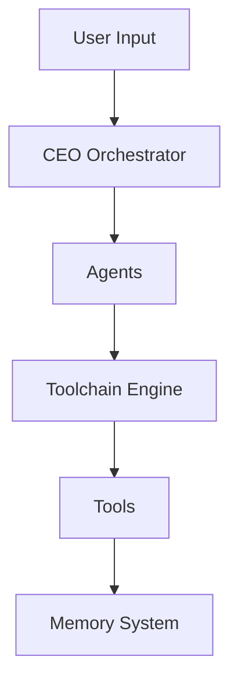

# Images

## Overview

The **images** directory contains visual assets for documentation, including screenshots, diagrams, architecture illustrations, and UI mockups. These images support README files, documentation, and user guides throughout the Vera-AI repository.

## Purpose

Images provide:
- **Visual documentation** - Screenshots of UI components and features
- **Architecture diagrams** - System design and component relationships
- **User guidance** - Visual aids for installation and usage
- **Troubleshooting** - Reference images for debugging
- **Marketing materials** - Project overview and feature highlights

## Contents

### Screenshots
- **`memory_ui.jpg`** - Memory Explorer interface showing knowledge graph visualization
- **UI components** - ChatUI, toolchain monitor, focus board views
- **Dashboard examples** - Proactive Background Cognition dashboard

### Diagrams
- **Architecture diagrams** - System component relationships
- **Network topology** - Example network graphs from ingestors
- **Data flow** - How information moves through Vera's systems

### Mockups
- **Feature previews** - Upcoming UI features
- **Design concepts** - UI/UX explorations

## Usage in Documentation

### Markdown Reference
```markdown

*The Memory Explorer showing knowledge graph visualization*
```

### HTML Reference
```html

<p><i>Interactive knowledge graph visualization</i></p>
```

### Relative Paths
When referencing from different directories:
```markdown
<!-- From root README.md -->


<!-- From subdirectory README.md -->


<!-- From nested subdirectory -->

```

## Image Guidelines

### File Naming
- Use descriptive, lowercase names with underscores
- Include component name: `memory_explorer_graph.jpg`
- Include context: `chatui_conversation_example.png`
- Avoid spaces and special characters

**Good:** `toolchain_execution_progress.png`
**Bad:** `Screen Shot 2024-01-15.png`

### File Formats
- **PNG** - Screenshots, UI elements, diagrams (lossless)
- **JPG** - Photos, complex images (smaller file size)
- **SVG** - Vector diagrams, logos (scalable)
- **GIF** - Animated demonstrations (use sparingly)

### Image Optimization
Before committing images, optimize file size:

```bash
# Optimize PNG
pngquant --quality=65-80 input.png --output output.png

# Optimize JPG
jpegoptim --max=85 image.jpg

# Batch optimize all images
find images/ -name "*.png" -exec pngquant --quality=65-80 {} --output {}.optimized \;
find images/ -name "*.jpg" -exec jpegoptim --max=85 {} \;
```

### Recommended Dimensions
- **Full screenshots:** 1920x1080 or 1280x720
- **Component screenshots:** 800x600 or 1024x768
- **Diagrams:** Minimum 800px width for readability
- **Icons:** 512x512 or 256x256

## Screenshot Capture

### UI Screenshots
Capture clean screenshots with:
- Closed browser dev tools
- Minimal clutter in browser UI
- Representative data (not debug/test content)
- Consistent theme (light or dark mode)

### Command-Line Screenshots
Use terminal with:
- Readable font size (14pt+)
- Clear color scheme
- Clean prompt
- Relevant output only

### Network/Graph Visualizations
- Zoom to fit important nodes
- Use clear labels
- Include legend if needed
- Export high-resolution for detail

## Creating Diagrams

### Architecture Diagrams
Tools for creating system architecture diagrams:
- **draw.io** (diagrams.net) - Free, web-based
- **Lucidchart** - Professional diagramming
- **Mermaid** - Code-based diagrams (in markdown)
- **PlantUML** - Code-based UML diagrams

**Example Mermaid Diagram:**
```markdown

```

### Data Flow Diagrams
Show how data moves through Vera:
```
User Query → Triage Agent → Planning Agent → Execution → Memory Storage
```

## Image Organization (Proposed)

For better organization as the repository grows:

```
images/
├── README.md
├── screenshots/
│   ├── chatui/
│   │   ├── conversation.png
│   │   ├── graph_explorer.png
│   │   └── toolchain_monitor.png
│   ├── memory_explorer/
│   │   ├── graph_view.png
│   │   └── timeline.png
│   └── dashboards/
│       ├── pbc_dashboard.png
│       └── orchestrator_status.png
├── diagrams/
│   ├── architecture/
│   │   ├── system_overview.svg
│   │   └── memory_layers.svg
│   ├── workflows/
│   │   └── toolchain_execution.svg
│   └── data_flow/
│       └── memory_promotion.svg
├── examples/
│   ├── network_topology.png
│   └── knowledge_graph_sample.png
└── logos/
    └── vera_logo.svg
```

## Accessibility

### Alt Text
Always provide descriptive alt text:
```markdown

```

### Color Contrast
Ensure diagrams have sufficient contrast for visibility:
- Use colorblind-friendly palettes
- Don't rely solely on color to convey information
- Include labels and patterns

### Text in Images
Minimize text in images:
- Use large, readable fonts
- Prefer system diagrams in code (Mermaid, PlantUML)
- Provide text descriptions for screen readers

## License and Attribution

### Screenshots
Screenshots of Vera UI are under the same license as the repository.

### Third-Party Images
If using images from external sources:
- Ensure compatible license
- Provide attribution in caption
- Link to original source

### User-Generated Content
When users contribute screenshots:
- Blur sensitive information
- Remove personal data
- Use example/demo data

## Contributing Images

When adding images to the repository:

1. **Capture/Create Image**
   - Follow naming guidelines
   - Use appropriate format (PNG/JPG/SVG)
   - Ensure high quality and readability

2. **Optimize File Size**
   ```bash
   pngquant --quality=65-80 screenshot.png
   ```

3. **Add to Repository**
   ```bash
   git add images/new_screenshot.png
   git commit -m "docs: Add screenshot of new feature"
   ```

4. **Update Documentation**
   - Reference image in relevant README
   - Provide descriptive caption
   - Include alt text

5. **Create Pull Request**
   - Explain what image shows
   - Mention which docs use it
   - Verify image displays correctly

## Image References in Main README

Images currently used in the main README:
- `images/memory_ui.jpg` - Memory Explorer visualization

To add more:
```markdown
<!-- In README.md -->
## Feature Overview


*Real-time chat interface with toolchain monitoring*


*Vera's multi-layered memory architecture*
```

## Troubleshooting

### Image Not Displaying
```markdown
<!-- Check relative path -->


<!-- Check file exists -->
ls images/filename.png

<!-- Check markdown syntax -->

```

### Image Too Large
```bash
# Check file size
ls -lh images/large_image.png

# Optimize
pngquant --quality=60-80 images/large_image.png --output images/large_image_optimized.png

# Replace original
mv images/large_image_optimized.png images/large_image.png
```

### Broken Links After Rename
```bash
# Find all markdown files referencing old name
grep -r "old_name.png" .

# Update references
sed -i 's/old_name.png/new_name.png/g' README.md
```

## Best Practices

- **Before committing:** Optimize image file size
- **Naming:** Use descriptive, consistent names
- **Organization:** Group related images in subdirectories (when collection grows)
- **Documentation:** Reference images in relevant docs
- **Accessibility:** Always include alt text
- **Version control:** Don't commit extremely large images (>5MB)
- **Privacy:** Remove sensitive information from screenshots

## Tools and Resources

### Screenshot Tools
- **Linux:** `gnome-screenshot`, `flameshot`, `spectacle`
- **macOS:** Built-in Screenshot app (Cmd+Shift+5)
- **Windows:** Snipping Tool, Snip & Sketch
- **Cross-platform:** ShareX, Lightshot

### Image Editing
- **GIMP** - Full-featured image editor
- **Inkscape** - Vector graphics editor
- **ImageMagick** - Command-line image manipulation
- **Krita** - Digital painting and editing

### Diagramming
- **draw.io** - https://app.diagrams.net/
- **Mermaid Live Editor** - https://mermaid.live/
- **PlantUML** - https://plantuml.com/

### Optimization
- **pngquant** - PNG compression
- **jpegoptim** - JPEG compression
- **svgo** - SVG optimization
- **ImageOptim** (macOS) - Batch optimization

## Related Documentation

- [Main README](../README.md) - Uses images for feature overview
- [Memory Explorer](../Memory/dashboard/dashboard.md) - Screenshots of graph UI
- [ChatUI](../ChatUI/README.md) - UI component screenshots

## Contributing

To improve the images directory:
1. Add missing screenshots for undocumented features
2. Create architecture diagrams
3. Organize images into subdirectories
4. Optimize existing images for file size
5. Add SVG versions of diagrams for scalability

---

**Note:** Keep images relevant, optimized, and well-documented. Remove outdated screenshots when features change significantly.
